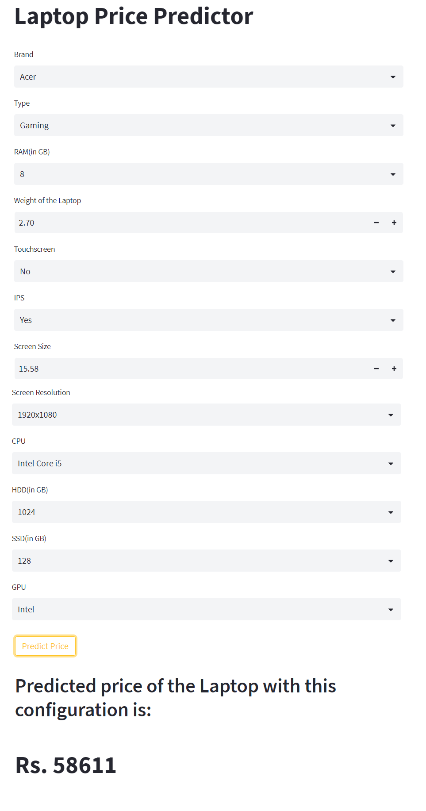

# Laptop Price Predictor
This notebook is trying to build a model which will predict the price of the laptop based on the given specifications. The dataset is taken from Kaggle.  
The dataset is taken from <a href="https://www.kaggle.com/datasets/arijitbanerjee009/laptop">Kaggle: Laptop dataset</a>  
You can follow the analysis on <a href="https://www.kaggle.com/code/shrikrishnaparab/laptop-price-prediction">Kaggle</a>  

## Packeges Used:
 ![Python][python] ![scikit-learn][sklearn-image] ![Pandas][Pandas-image]  ![Jupyter Notebook][ipython-image]  
 
[python]: https://img.shields.io/badge/python-3670A0?style=for-the-badge&logo=python&logoColor=ffdd54
[sklearn-image]:https://img.shields.io/badge/scikit--learn-%23F7931E.svg?style=for-the-badge&logo=scikit-learn&logoColor=white
[Pandas-image]: https://img.shields.io/badge/pandas-%23150458.svg?style=for-the-badge&logo=pandas&logoColor=white
[ipython-image]: https://img.shields.io/badge/jupyter-%23FA0F00.svg?style=for-the-badge&logo=jupyter&logoColor=white

## Problem Statement
Our application aims to use Machine Learning to provide accurate and personalized laptop price estimates to users based on their specific configurations, such as brand, model, CPU, RAM, storage, and graphics card. By utilizing a combination of data gathering and advanced algorithms, our application will be able to quickly and efficiently provide users with an estimated price range for their desired laptop, helping them make informed purchasing decisions.

## About Dataset
This data is taken from kaggle. The lin to download the dataset is given above. Through the process of feature engineering, we can effectively extract valuable information from a dataset that may contain a significant amount of noise. By applying various data mining techniques, we can carefully select and transform the features to reduce noise and enhance the quality of the data, resulting in improved performance of machine learning models.

## EDA
Exploratory Data Analysis (EDA) is a crucial step in the machine learning process as it allows for a thorough understanding and examination of the data and its relationships. By utilizing various techniques such as univariate, bivariate, and multivariate analysis, EDA enables us to validate assumptions and hypotheses, identify patterns, and uncover insights that can inform feature engineering and modeling decisions. Preprocessing and feature engineering tasks can also be performed during EDA to further improve the quality of the data. The ultimate goal of EDA is to prepare and clean the dataset to achieve high performance and generalized models. By conducting in-depth EDA, we can ensure that our machine learning models are well-informed and optimized for prediction.

## Machine Learning Modeling and Exporting
With the thorough understanding and preparation of our dataset obtained through Exploratory Data Analysis, we are now in a prime position to move forward with the machine learning modeling process. Our next step is to evaluate various algorithms and their associated hyperparameters to determine the combination that yields the highest level of accuracy.

## Deployment:
Streamlit is used to build a front-end of the web application for Laptop Price Predictor and is deployed on huggingface.co.

### Check the app:

